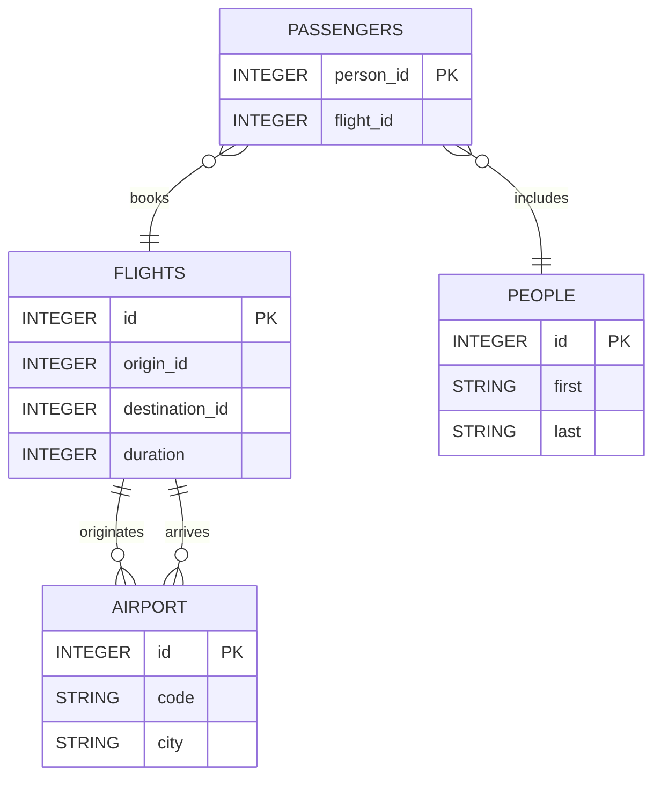

# Diagrama de Entidad-Relación (DER)

A continuación se presenta el diagrama de entidad-relación para la base de datos de vuelos, aeropuertos, pasajeros y personas.

# Diccionario de Datos

## Tablas y Atributos

| Tabla        | Atributo             | Tipo        | Descripción                                      |
|--------------|----------------------|-------------|--------------------------------------------------|
| **FLIGHTS**  | `id`                 | INTEGER     | Identificador único del vuelo (PK).              |
|              | `origin_id`          | INTEGER     | ID del aeropuerto de origen.                     |
|              | `destination_id`     | INTEGER     | ID del aeropuerto de destino.                    |
|              | `duration`           | INTEGER     | Duración del vuelo en minutos.                   |
| **AIRPORT**  | `id`                 | INTEGER     | Identificador único del aeropuerto (PK).         |
|              | `code`               | STRING      | Código del aeropuerto.                            |
|              | `city`               | STRING      | Ciudad donde se encuentra el aeropuerto.         |
| **PASSENGERS**| `person_id`         | INTEGER     | ID de la persona (pasajero) (PK).               |
|              | `flight_id`          | INTEGER     | ID del vuelo en el que está el pasajero.        |
| **PEOPLE**   | `id`                 | INTEGER     | Identificador único de la persona (PK).          |
|              | `first`              | STRING      | Nombre de la persona.                            |
|              | `last`               | STRING      | Apellido de la persona.                          |

